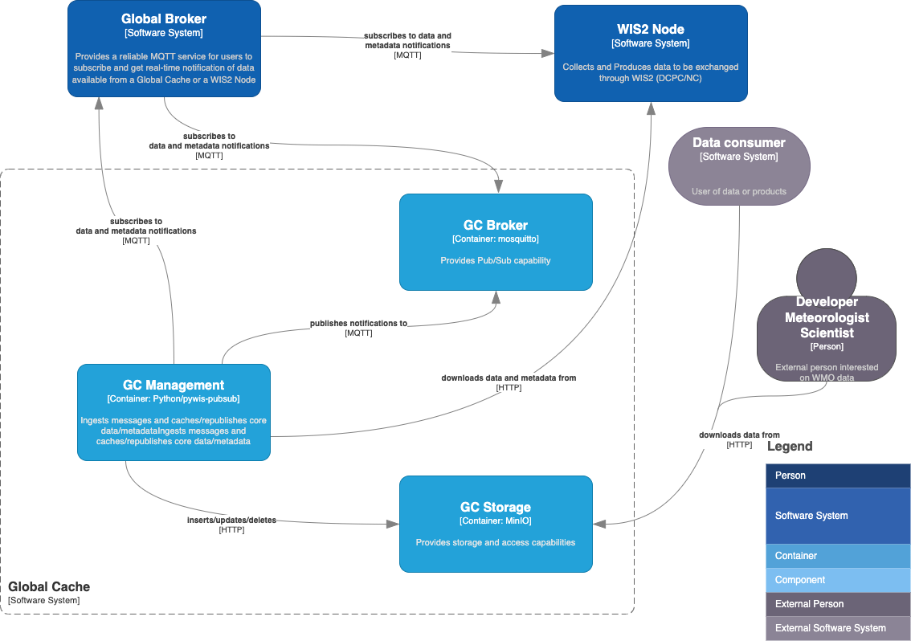

[](https://github.com/wmo-im/wis2-gc/actions)

# wis2-gc

wis2-gc is a Reference Implementation of a WIS2 Global Cache.

<a href="docs/architecture/c4.container.png"></a>

## Workflow

- connects to a WIS2 Global Broker, subscribed to the following:
  - 'origin/a/wis2/+/data/core/#'
  - 'origin/a/wis2/+/metadata/#'
- on all notifications:
  - download and store data to object storage
  - publish notification of cached object

## Installation

### Requirements
- Python 3
- [virtualenv](https://virtualenv.pypa.io)

### Dependencies
Dependencies are listed in [requirements.txt](requirements.txt). Dependencies
are automatically installed during pywis-pubsub installation.

### Installing wis2-gc

```bash
# setup virtualenv
python3 -m venv --system-site-packages wis2-gc
cd wis2-gc
source bin/activate

# clone codebase and install
git clone https://github.com/wmo-im/wis2-gc.git
cd wis2-gc
pip3 install .
```

## Running

```bash
# setup environment and configuration
cp wis2-gc.env local.env
vim local.env # update accordingly

source local.env

# setup pywis-pubsub - sync WIS2 notification schema
pywis-pubsub schema sync

# setup backend
wis2-gc setup

# teardown backend
wis2-gc teardown

# connect to Global Broker
# notifications will automatically trigger wis2-gc to cache data
# and send a notification to the local broker
pywis-pubsub subscribe --config pywis-pubsub.yml --download

# cleanup data older than n days (default is 2)
wis2-gc clean --days 3
```

### Docker

The Docker setup uses Docker and Docker Compose to manage the following services:

- **wis2-gc-broker**: MQTT broker
- **wis2-gc-management**: management service to ingest and process notification messages, download data and publish messages against `cache/a/wis2/...`
  - the default Global Broker connection is to NOAA.  This can be modified in `wis2-gc.env` to point to a different Global Broker
- **wis2-gc-storage**: storage and access capability

See [`wis2-gc.env`](wis2-gc.env) for default environment variable settings.

To adjust service ports, edit [`docker-compose.override.yml`](docker-compose.override.yml) accordingly.

The [`Makefile`](Makefile) in the root directory provides options to manage the Docker Compose setup.

```bash
# build all images
make build

# build all images (no cache)
make force-build

# start all containers
make up

# start all containers in dev mode
make dev

# view all container logs in realtime
make logs

# login to the wis2-gc-management container
make login

# restart all containers
make restart

# shutdown all containers
make down

# remove all volumes
make rm
```

## Development

### Running Tests

```bash
# install dev requirements
pip3 install -r requirements-dev.txt

# run tests like this:
python3 tests/run_tests.py

# or this:
python3 setup.py test
```

### Code Conventions

* [PEP8](https://www.python.org/dev/peps/pep-0008)

### Bugs and Issues

All bugs, enhancements and issues are managed on [GitHub](https://github.com/wmo-im/wis2-gc/issues).

## Contact

* [Tom Kralidis](https://github.com/tomkralidis)
